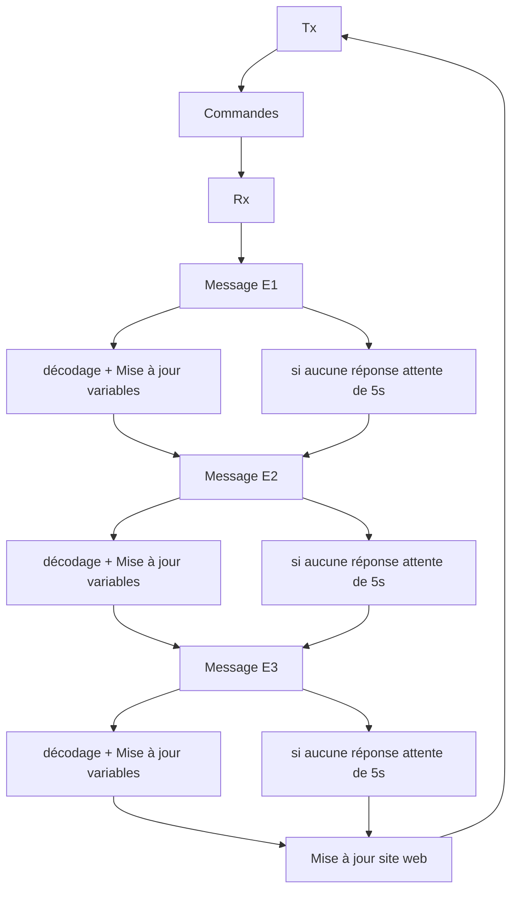
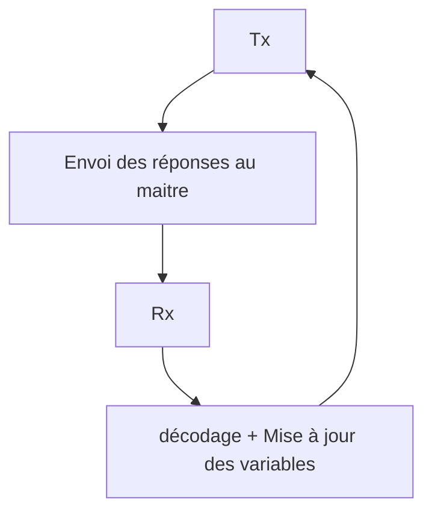

# LoRaWAN
*Git Hub contenant les ressources pour le projet LoRaWAN*

## Problématique
Le but de ce projet est de mettre en place la structure de base d'une communication entre appareils équipés de microprocesseurs STM32 commandant des modules LoRa-E5 par communication UART. L'idée est de profiter de la présence de la même architecture dans tous les projets pour développer une version pour Nucleo-64 facilement portable vers d'autres cartes avec des microprocesseurs STM32. Le code doit pouvoir en plus permettre d'envoyer 4 ko au maximum à travers une connexion LoRa ou LoRaWAN.

Comme il a été mentionné plus haut, nous avons développé la structure de base qui doit donc être adaptée à chaque projet notamment pour permettre d'interpréter les différentes informations que chaque projet doit transmettre ou recevoir à travers le protocole développé ici.

## Liste des taches prévues en volume horaire

1. **Gateway: trouver une solution 12h**
 - Le fabriquer à partir d'un autre module

2. **Programmer les modules esclaves 8h**
 - Tester les connexions avec la Gateway

3. **Mettre en place la réception finale 8h**
 - Effectuer des tests
 - Prévoir site web pour récupérer les données reçues

## Avancement par séances :   
*Décharge de responsabilité : Les heures non comptées dans ce récapitulatif ont servi à nous informer, comprendre le fonctionnement du protocole loRa et faire les impératifs sur les projets du à nos responsabilités au sein des groupe. Toutes nos sources sont listés avec des liens ci dessus ou bien en PDF dans les différents dossiers du projet.*    
   
- 16/05/2022 : 
  1. Mise en place de la connection UART carte-carte 1h
  2. Communication entre STM32 et module LoRa-E5 grâce à des commandes AT 1h
- 17/05/2022 :
  1. Mise en place de la communication LoRa entre deux modules 4h
- 23/05/2022 :
  1. On choisit de partir sur une connection LoRa PURE et non LoRaWAN
     (Gateway fonctionnelle pas en place et iréalisable en 8h) 2h
- 24/05/2022 : 
  1. Soutenance des projets 3h
  2. Développement d'un protocole de communication pour le réseau LoRa 1h
- 27/05/2022 : 
  1. Description du protocole LoRa du projet 3h
  2. Test d'une communication longue distance (~8km). Résultat : pas de communication donc porté <8km
- 30/05/2022 : 
  1. Programmation en C du protocole esclave 3h
  2. Mise en place de FileZilla + résolution de problèmes mineurs
- 31/05/2022 :  
  1. Fin de la programmation en C du protocole esclave (base à distribuer aux groupes) 4h
- 1/05/2022 :  
  1. Fin du squelette du script esclave : capacité à interpréter les infos reçues suivant le protocole 2h
  2. Programmation en Python du protocole maitre (partiellement) 2h
  3. Démo finale

# Protocole LoRa du projet
## Infos utiles
- Après beaucoup de recherche nous avons jugé qu'il était plus judicieux de partir sur une communication LoRa plutôt que LoRaWAN pour ce protocole pour pouvoir respecter le budget et le temps imparti pour réaliser cette partie des projets 
- Temps de transmission de 4ko : 3 secondes
- Délais entre deux transmissions consécutives de 4ko (temps de transmission compris) : 5s
- Les détails du focntionnement du code en langage C est directement embarqué dans le code source des projets CubeIDE sous forme de commentaires adaptés à Doxygen

## Fonctionnement
La transmission :
- Maitre->Esclave se fait en Hexadécimal
- Esclave->Maitre se fait en char   
Par défaut, la réception de messages n'est possible qu'en Hexa pour le module LoRa-E5 en mode LoRa.

### 1. Maitre

Trame reçue par les esclaves : #ID$CM$DATA?    
Avec :
- ID : id de l'esclave en Hexadécimal, FF pour les messages concernant tous les esclaves et 00 pour le mode test
- CM : une commande parmis les suivantes :   
      - 0 : test   
      - 1 : send   
      - 2 : receive   
- DATA : en cas de commande "receive" ce sont les données à recevoir. 00 sinon    
- "#" : caractère de début de trame   
- "$" : caractère de séparation   
- "?" : caractère de fin   
   
Graph d'état : fonctionnement du protocole :     

### 2. Esclaves

Trame reçue par le maitre : #ID$DATA?   
Avec :
- "#" : caractère de début de trame   
- "$" : caractère de séparation   
- "?" : caractère de fin   
- ID : id de l'esclave en Hexadécimal, FF pour les messages concernant tous les esclaves et 00 pour le mode test   
- DATA : données du capteur. Plusieurs informations peuvent être séparés avec le caractère "$"   
   
Graph d'état : fonctionnement du protocole :     

## Liens utiles pour comprendre la communication LoRa et LoRaWAN avec le module LoRa-E5 :
 - Modules utilisés : https://wiki.seeedstudio.com/Grove_LoRa_E5_New_Version/ 
 - Tuto LoRaWAN de Seeed studio : https://www.seeedstudio.com/blog/2020/08/03/lorapedia-an-introduction-of-lora-and-lorawan-technology/ 
 - Doc des modules utilisés : https://files.seeedstudio.com/products/317990687/res/LoRa-E5%20module%20datasheet_V1.0.pdf
 - Doc des microprocesseurs des modules utilisés : https://files.seeedstudio.com/products/317990687/res/STM32WLE5JC%20Datasheet.pdf
 - Video "LoRaWan end node": https://www.youtube.com/watch?v=duwUwXt-hs8&list=PL3XBzmAj53Rkkogh-lti58h_GkhzU1n7U&index=3&ab_channel=AndreasSpiess
 - Tuto AT : https://www.disk91.com/2021/technology/lora/lora-e5-the-seeed-studio-stm32-wl-module/
 - tuto At arduino : https://create.arduino.cc/projecthub/sufiankaki/lora-e5-communication-without-lorawan-9fbddc?ref=part&ref_id=10308&offset=18
